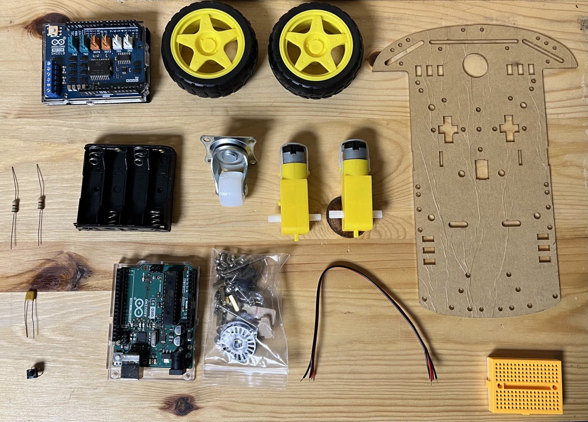

# Moth Bot

## Objectives

Let's get familiar with how the MothBot works!

The primary objective of this project is to explore the use of photoresistors, a.k.a. "light sensors," in robotics. By building a moth-inspired robot, we will learn how these sensors mimic the light-seeking behavior of moths to help the robot navigate its environment and follow light sources.

Through this project, we will:

- Understand the working principles of photoresistors.
- Gain hands-on experience in assembling and programming a simple robot.
- Learn about basic electronics and Arduino programming.
- Explore how sensors can be used for light detection and movement.

## Requirements
### Hardware
- **Simple Robot Chassis Kit**: Includes 2 DC motors, 2 wheels, and a battery holder.
- **Photoresistors (Light Sensors)**: Sensors that detect light intensity.
- **Arduino Uno + Cable**: Microcontroller board for programming and controlling the robot.
- **CAROBOT Motor Shield v3**: Extension board for driving the motors.
- **0.1 microF Capacitors (x2)**: For filtering noise in the circuit.
- **Resistors**:
  - 220 ohm resistors (x2) for current limiting.
  - 10k ohm resistor (x1) for the push button.
- **Push Button**: For starting or resetting the robot.
- **Mini Breadboard**: For creating the circuit connections.
- **Jumper Wires**: For connecting components on the breadboard.
- **AA Batteries (x4)**: Power source for the robot.

### Software
- **Arduino IDE**: Integrated Development Environment for writing and uploading code to the Arduino board.
- **Basic C/C++ Programming Knowledge**: To understand and write the Arduino code.

  

## Bill of Material:
1. Simple Robot Chassis Kit (2 DC motors, 2 Wheels, battery holder)
2. Photoresistors (Light Sensors)
3. Arduino Uno + Cable
4. CAROBOT motor shield v3
5. 0.1 microF capacitor
6. 220 Ohms resistor
7. 10k Ohms resistor
8. push button
9. mini breadboard
10. Jumper wires
11. AA batteries

  

## Design
The Moth Bot is designed to mimic the behavior of a moth using its light-seeking eyes for navigation. The design includes:
- **Chassis and Motors**: The base structure of the robot with wheels driven by DC motors.
- **Photoresistors**: Attached to the front of the robot, acting as eyes to detect light intensity.
- **Arduino and Motor Shield**: Central control system that processes sensor data and controls the motors.
- **Power Supply**: Batteries to power the entire system.
- **Push Button**: For user interaction to start or reset the robot.

When the photoresistors detect light, they measure the intensity of the light. The Arduino reads this data and adjusts the robot's movement, turning towards the side with more light until both sensors detect equal light, then moving towards the brightest spot.

## Implementation
1. **Assemble the Chassis**: Attach the DC motors and wheels to the chassis. Insert the batteries into the holder.
2. **Set Up the Photoresistors**: Connect the photoresistors to the mini breadboard and wire them to the Arduino. Use the capacitors and resistors as needed.
3. **Install the Motor Shield**: Attach the motor shield to the Arduino and connect the DC motors.
4. **Connect the Push Button**: Wire the push button to the Arduino through the breadboard.
5. **Write the Code**: Use the Arduino IDE to write a program that reads the photoresistor data and controls the motors based on the sensor input.
6. **Test and Debug**: Upload the code to the Arduino, test the robot’s functionality, and make necessary adjustments.

  

## Conclusion
Through this project, you will have gained practical experience in building and programming a robot, understanding the use of photoresistors for light detection, and learning basic principles of electronics and robotics. This hands-on project not only enhances your technical skills but also emphasizes the "hows" and "whys" by demonstrating real-world applications of sensors and robotics.
