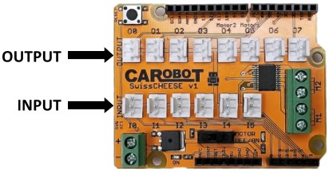

# CarduBlock Edu Tutorial
 
ArduBlock is a simple, fast, and fun way to program the CAROBOT SwissCHEESE. ArduBlock is a graphical programming language for Arduino that’s almost the same as Scratch. To follow this tutorial, you will need a computer and a CAROBOT SwissCHEESE education kit, including an Arduino Uno. This tutorial will be using the CarduBlock Edu branch of ArduBlock, a simplified version of the program that’s specialized for the SwissCHEESE.

### Contents
<!-- These should all be links to the products where you can purchase each part -->
- CAROBOT SwissCHEESE
- Opening CarduBlock Edu
- Project 1 – Blinking a Green LED
- Project 2 – The Button
- If/Else
- Project 3 – The Servo
- Project 4 – Controlling a Servo with a Potentiometer
- The Buzzer
-.1 Frequency
- The Variable
- Project 5 – The Buzzer

## CAROBOT SwissCHEESE

The CAROBOT SwissCHEESE is an add-on for Arduino designed to stack on top of the Arduino board. The SwissCHEESE allows us to easily use the inputs and outputs of the Arduino. Input is when the microcontroller is reading information from the outside world such as a button, while output is when the microcontroller displays information to the outside world such as blinking a light. We call each SwissCHEESE module a “Slice”.

Figure: Slice

### Opening CarduBlock Edu
CarduBlock Edu is built into the Arduino IDE. If you don’t already have the Arduino software, download it here. The CarduBlock Edu software comes separately, and a tutorial for installing it, as well as the download link, is found here. Once everything is set-up, we can move to Step 1!

1. Connect the USB cable to the Arduino board and to your computer.
2. Open the Arduino IDE software. You need to do the following two steps every time you start programming an Arduino board or else it might give you an error.
3. Go to <b> Tools > Board > </b> Select <b> “Arduino/Genuino Uno” </b>
4. Go to <b> Tools > Port > </b> Select the <b> COM# </b> for your Arduino. Note: It might not be COM6 as shown in the picture
<!-- A screenshot showing where "Port" is found. -->
5. Open CarduBlock Edu from <b> Tools > CarduBlock Edu </b>
<!-- A diagram depicting the CarduBlock Edu interface. -->

### Project 1 – Blinking a Green LED

For Project 1, we are going to connect a green LED with the Arduino/SwissCHEESE board and program it so the green LED will blink. You’ll need the Arduino/SwissCHEESE board, a green LED Slice, a SwissCHEESE Wire, and a USB cable for power.

<!-- Add in photo here of swiss cheese with Green LED -->

1. <u>Always</u> disconnect the power (USB cable) when wiring electronics.

2. On the SwissCHEESE: Connect a wire from O0 (which stands for OUTPUT #0) of the board to the green LED Slice.<!-- A CAROBOT SwissCHEESE on an Arduino with a green LED module. -->

3. On your computer: From the Control bin, drag a loop to your sketch if it’s not already there. Every Arduino program needs the “loop” block. If it is missing, Cardublock Edu will give you an error.
<!-- A diagram of the control bin and the loop block in CarduBlock Edu. -->

4. From the SwissCHEESE bin, drag and connect a “LED” to the loop in your sketch. Note that the “pin#” is already set to O0, which is the one we want.
<!-- A diagram of the CAROBOT SwissCHEESE bin and the LED block in CarduBlock Edu. -->

5. From the “Control” bin, drag and connect “delay MILLIS” to below the “LED” code block. Note that you can have longer or shorter delays depending on the number beside “milliseconds” (1 second = 1000 milliseconds just like 1 meter = 1000 millimeters).
<!-- A diagram of the Control bin and the delay block in CarduBlock Edu. -->

6. Repeat steps 4 and 5 once, building on the block of code inside “loop”. This time, change “status” in the second “LED” code block from “ON” to “OFF”.
<!-- A diagram of the blink program in CarduBlock Edu. -->

7. Press the save button to save the sketch on your computer (be organized and save the file with a name you can recognize the program by). Remember to save often; who knows when your computer might freeze or if there will suddenly be a blackout. You don’t want to lose all your work.
<!-- A diagram of the saving the CarduBlock Edu program. -->

8. On your computer: Press “Upload to Arduino” to upload the program to your Arduino board (your computer will ask you to save your program again after you press upload, so go ahead and do so).
<!-- A diagram of uploading the Cardublock Edu program to Arduino. -->

9. If you were successful, the green LED should turn on for one second, then turn off for one second, and repeat.

### Project 2 – The Button

Next, we are going add some inputs. The most common and simple input is a push button. When the button gets pushed, it closes a circuit and the Arduino reads this and reacts accordingly.

<!-- A picture of the CAROBOT SwissCHEESE shield.A CAROBOT SwissCHEESE green LED.A CAROBOT SwissCHEESE yellow LED.A CAROBOT SwissCHEESE red LED.A CAROBOT SwissCHEESE green button. -->

1. <u>Always</u> disconnect the power (USB cable) when wiring electronics.
2. Pay attention, a button is an input. Therefore, we will use the input connection instead of the output connection. On your SwissCHEESE: Connect one wire from I0 to the button Slice.
3. From the Control bin, drag an “if” block to your sketch
<!-- CarduBlock Edu Tutorial -->
4. From the SwissCHEESE bin, drag out and connect a Button block to your if code block.
<!-- CarduBlock Edu Tutorial -->
5. Disconnect the LED blink code in your loop code block and connect it to the “then” section of your if code block
6. Drag the whole if code block into the loop code block.<!-- CarduBlock Edu Tutorial -->
7. Remember to and save when you’re finished. Plug your board in and upload the file. See that none of the LEDs are on!
<!-- How the program looks after step 7. -->
8. Press the button and see what happens.

### If/Else
“If” and “Else” is a very important idea in programming because it allows the microcontroller to make decisions. The idea is actually very simple: If something happens (or a certain condition is true), then the program will do something (do the code in the “then” area). If that something did not happen (or a certain condition is not met), then the program will do something else (do the code in the “else” area). It’s almost the same as asking a question.

### Project 3 – The Servo
A Servo is a small device that has an output shaft. This shaft moves to particular places by sending the servo a signal. As long as the signal exists, the servo will keep its place. As the signal changes, shaft’s position changes. Servos are used in radio controlled airplanes and are also used in radio controlled cars, puppets, and of course, robots. For Project 3, we are going to connect a Servo with the SwissCHEESE board and program it so that the Servo can rotate back and forth between two angles.
A servo.

1. <u>Always</u> disconnect the USB cable (power) when wiring electronics.
2. On the SwissCHEESE board: Connect the Servo to O0.
3. On your computer: From the Control bin, drag a loop block to your sketch if it’s not already there. Remember that we always need a loop when programming with CarduBlock Edu.
4. From the SwissCHEESE bin, drag a Servo block to your sketch and connect it to the loop in your sketch. Change the angle to 1.
<!-- A diagram of step 4. -->
5. Add a delay block under the Servo block.
6. Repeat steps 4 to 6 once, adding to the block of code inside the loop. This time, use 180 as the angle.
<!-- How the program looks after step 6. -->
7. Plug in your board and upload the file. If you were successful, the Servo will be moving back and forth.

### Project 4 – Controlling a Servo with a Potentiometer
Sometimes, we want the ability to move the servo to any place. To do this we use something called a potentiometer.

1. <u>Always</u> disconnect the USB cable when wiring electronics.
2. On the SwissCHEESE board: Connect the potentiometer Slice to I0.
3. Like step 4 in the last project, we’ll put a Servo block in the loop block. However, drop the angle this time.
<!-- How the program looks after step 3. -->
4. From the Math Operators bin, drag the map block and fit it into the angle slot of the Servo block. Make sure the value is from (0 – 1023) to (0 – 180). The map block turns a number that at first ranges from 0-1023 to a number that ranges from 0-180. For example, 0 will remain as 0 but the 1023 will become 180 after the operation, while 512 will become 90, and so on.
<!-- CarduBlock Edu TutorialA diagram of step 4. -->
We need to do this operation because while the value from the Potentiometer ranges between 0 and 1023, the angle signal for a servo can only be between 0 and 180.
5. Then, from the SwissCHEESE bin, drag a RotaryPotentiometer to the value slot of the map block.How the program looks like after step 5.
6. From the “Control” bin, add a short delay to the end of the loop. This is to make sure that we don’t overload the Servo with signals.
<!-- CarduBlock Edu Tutorial -->
7. Plug in your board and upload the file. If you were successful, the Servo will move left and right while you move the potentiometer left and right.
### The Buzzer
A buzzer is a device, almost the same as a speaker or a doorbell, that makes a sound. We can program the buzzer to make a higher or lower pitch, so if you string a bunch of tones together, you’ve got music!

<!-- A picture of the CAROBOT SwissCHEESE buzzer module. -->

### Frequency
Frequency is the rate a wave vibrates at for a wave, which is important because sounds are actually the vibrations of the atoms in the air. The higher the frequency, the higher the pitch. You can use the chart of frequencies below to make music. The red row is the octave of middle C.
<!-- Fix this table -->
<b> 8VA </b>
| Note  |   C   |  C#/Db |   D   | D#/Eb |   E   |   F   | F#/Gb |   G   | G#/Ab |   A   | A#/Bb |   B   |
|:------|:------|:-------|:------|:------|:------|:------|:------|:------|:------|:------|:------|:------|
|   3   | 131   |  138   |  146  |  155  |  164  |  174  |  184  |  195  |  207  |  220  |  233  |  246  |
|   4   | 261   |  277   |  293  |  311  |  329  |  349  |  369  |  391  |  415  |  440  |  466  |  493  |
|   5   | 523   |  554   |  587  |  622  |  659  |  698  |  739  |  783  |  830  |  880  |  932  |  987  |

<!-- A diagram showing musical notes and their positions on the grand staff.-->
### The Variable
In programming, we often want to store information for later use, so to do that, we need to use something called a variable. We can store information like numbers in variables, and that information can be assigned, used, and modified in the program at any time, so each variable must have a unique name for identification. If you want to use a variable, then just “call” its name.
CarduBlock Edu TutorialCarduBlock Edu Tutorial
The second picture creates a variable called “C4” and set its value to 261.

### Project 5 – The Buzzer
For Project 5, we are going to connect a buzzer Slice with the SwissCHEESE board and program it to create a song.

1. <u>Always</u> disconnect the USB cable when wiring electronics.
2. On the SwissCHEESE board: Connect a Buzzer to O0 and a Button to I0.
3. The first thing we have to do is declare our variables, so from the Variables/Constants bin, drag a set integer variable block into the main loop of your sketch.
<!-- CarduBlock Edu Tutorial -->
4. Change the variable name to “C4” and the value to “261”.
<!-- CarduBlock Edu Tutorial -->
5. Repeat step 4 and 5 three more times for:
A. variable “G3” having value “195”
B. variable “A3” having value “220”
C. variable “B3” having value “246”
<!-- CarduBlock Edu Tutorial -->
6. Add a If block and a Button block at the end of the sketch to get the following.CarduBlock Edu Tutorial
7. Next, we’ll add a Tone block from the SwissCHEESE bin into the then part of the If block.CarduBlock Edu Tutorial
8. Instead of using the value “440”, we’ll use the “C4” variable we created earlier. To do that, remove the “440” block and replace it with an Integer block, then we’ll rename the Integer block to “C4”.CarduBlock Edu Tutorial
9. Add a delay of “250” milliseconds after the Tone block, then add a NoTone block after the delay.CarduBlock Edu Tutorial
10. Plug in your board and upload the file. If you were successful, you should hear one tone, the middle C, when you press the button.
11. Now let’s add a few more tones to make a melody. To do this, repeat step 8 to 10 a few more times to create seven more tones. At the end, you should have the following eight tones:

| Note     | Delay    |
|----------|:---------|
| C4 (we already did this)| 250   |
| G3       | 125      |
| G3       | 125      |
| A3       | 250      |
| G3       | 250      |
|(Rest)    | 250      |
| B3       | 250      |
| C4       | 250      |

<!-- Music bars illustrating the notes. -->
<!-- A screenshot of the project 5 program in CarduBlock EDU. -->
Upload your program. If you were successful, you should hear a melody when you press the button.
